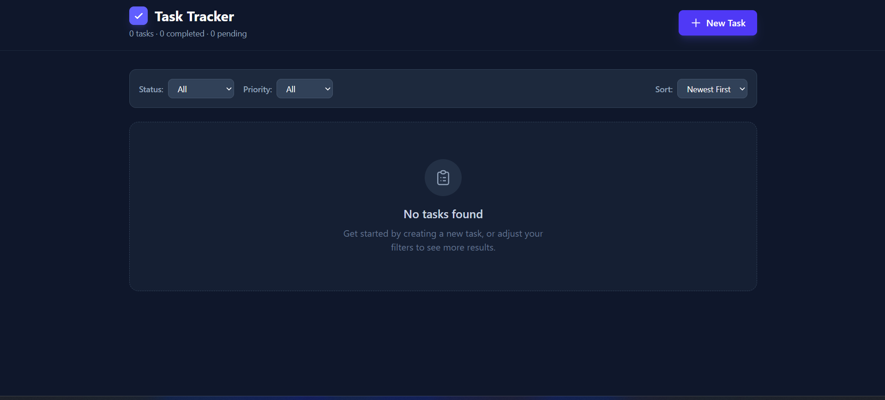

# Task Tracker
A minimal, full-stack task management application to keep track of what needs to get done.

## Why I built this
I needed a simple, no-nonsense way to manage my tasks without the clutter of heavy project management tools. It was also a great excuse to spin up a clean MERN stack project and write some straightforward React.

## Live Demo
task-tracker-ronit4.vercel.app

## Tech Stack
- **Frontend**: React, Vite, Tailwind CSS
- **Backend**: Node.js, Express
- **Database**: MongoDB, Mongoose

## Features
- Create, read, update, and delete tasks.
- Tag tasks with priority levels (Low, Medium, High).
- Set due dates and prevent picking dates in the past.
- Filter tasks by their current status and priority.
- Sort tasks by newest, oldest, or upcoming due dates.
- Real-time form validation with helpful error messages.
- Clean, responsive dark-mode UI.

## Folder Structure
```
task-tracker/
├── client/
│   ├── src/
│   │   ├── api/          # Frontend fetch calls
│   │   ├── components/   # React UI components
│   │   └── App.jsx       # Main app logic and state
│   └── ...
└── server/
    ├── models/           # Mongoose schemas
    ├── routes/           # Express API endpoints
    ├── index.js          # Server entry point
    └── ...
```

## How to run locally

**1. Clone the repo and navigate to the project directory:**
```bash
git clone <your-repo-url>
cd task-tracker
```

**2. Setup the backend:**
```bash
cd server
npm install
```
Create a `.env` file in the `server` directory (check `.env.example` for reference) and add your MongoDB connection string:
```
MONGODB_URI=your_mongodb_uri_here
PORT=5000
```
Start the server:
```bash
npm start
```

**3. Setup the frontend:**
Open a new terminal window:
```bash
cd client
npm install
```
Create a `.env` file in the `client` directory:
```
VITE_API_URL=http://localhost:5000
```
Start the development server:
```bash
npm run dev
```

## Environment Variables
**Server (`server/.env`)**
- `MONGODB_URI`: Connection string for your MongoDB database.
- `PORT`: The port the backend runs on (defaults to 5000).

**Client (`client/.env`)**
- `VITE_API_URL`: The URL of your backend API.

## API Endpoints

| Method | Route | Description |
|---|---|---|
| `GET` | `/api/tasks` | Get all tasks (supports `status` and `priority` filters) |
| `GET` | `/api/tasks/:id` | Get a single task by ID |
| `POST` | `/api/tasks` | Create a new task |
| `PUT` | `/api/tasks/:id` | Update an existing task |
| `DELETE` | `/api/tasks/:id` | Delete a task |

## Screenshots

